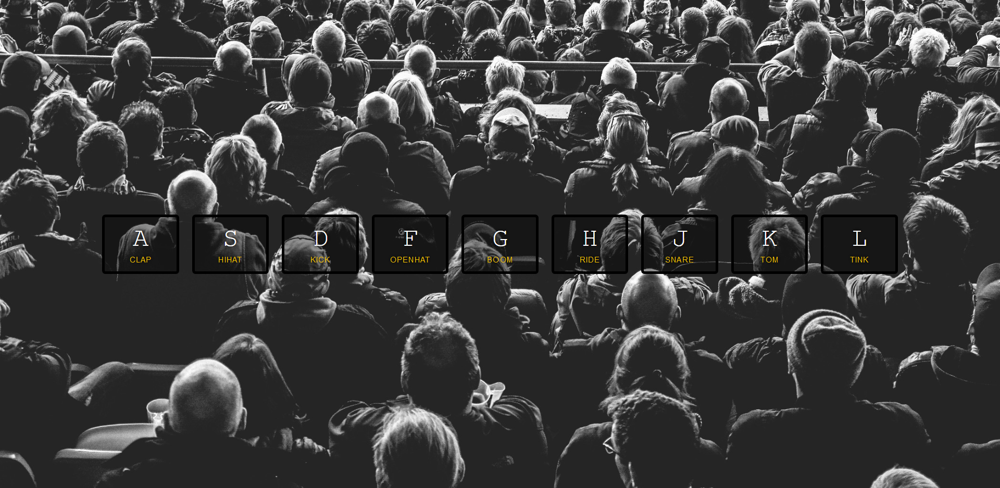

#Javascript Drum Kit
Javascript Drum kit project is the Day-01 project.
 

Here `keyCode` of the following keys will be listened to play the beat and transition of keys will happen.
All the sound files is available in [`sounds`](./sounds) folder. 

## Important Links

[`Keycode Website`](http://keycode.info/) -> This website can show the `keyCode` of the keyboard key's in JavaScript.
