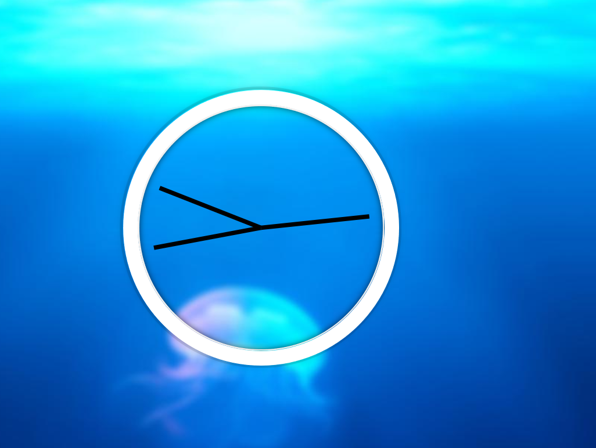

#CSS + JS Clock
`CSS + JS Clock` project is the Day-02 project.
 

This project is based on JavaScript which display time using `getSeconds()` `getMinutes()` `getHours()` function
from `Date`.

## Important Links
